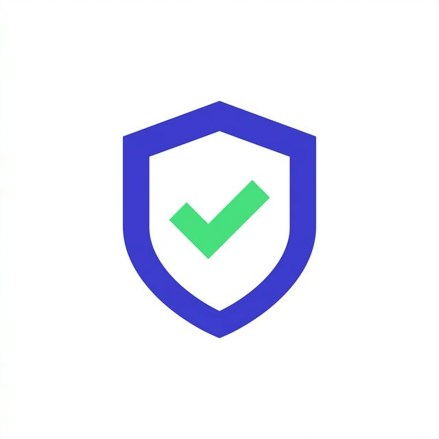

<div align="center">
  
  <h1>🛡️ OrderShield OMS</h1>
  <p><strong>A Modern, Decoupled Full-Stack Order Management System</strong></p>

  [](https://react.dev/)
  [](https://vitejs.dev/)
  [](https://tailwindcss.com/)
  [](https://laravel.com/)
  [](https://www.mysql.com/)

</div>

<br />

## 📖 Overview

**OrderShield** is a premium, enterprise-grade Order Management System (OMS) designed for high-performance administrative environments. Built with a decoupled architecture, the platform features a lightning-fast React 19 frontend consuming a highly secure Laravel 11 REST API.

The UI is meticulously crafted with **Tailwind CSS 4** and **Framer Motion**, delivering a "Security Hub" aesthetic with glassmorphism, dark-mode compatibility, and smooth micro-animations.

---

## ✨ Key Features

- **🔒 Secure Authentication:** Stateless Bearer token architecture via Laravel Sanctum.
- **📊 Live Analytics Dashboard:** Dynamic sales charting powered by Recharts.
- **🛍️ Catalog & Inventory:** Full product and category management.
- **📦 Order Processing:** Deep relational matrix handling complex orders, items, and customers.
- **📱 Responsive Design:** Desktop-first but entirely mobile-friendly administrative layout.
- **⚡ Lightning Fast:** Vite-powered React 19 frontend guarantees immediate HMR and instant page transitions.

---

## 🛠️ Technology Stack

### Frontend (React SPA)
* **Framework:** React 19 + TypeScript
* **Build Tool:** Vite 6
* **Styling:** Tailwind CSS 4
* **Animations:** Framer Motion
* **Icons:** Lucide React
* **Charts:** Recharts
* **State & Networking:** React Context API + Axios

### Backend (REST API)
* **Framework:** Laravel 11 (PHP 8.2+)
* **Database:** SQLite (Dev) / MySQL (Prod)
* **Authentication:** Laravel Sanctum (Token-based)
* **Architecture:** Decoupled MVC / API Resource Controllers

---

## 💻 Local Development Setup

### 1. Backend Setup
```bash
cd OrderShieldOMS-Backend

# Install dependencies
composer install

# Setup environment
cp .env.example .env
php artisan key:generate

# Run database migrations and seed mock data
php artisan migrate --seed

# Start the Laravel development server (runs on port 8000)
php artisan serve
```

### 2. Frontend Setup
```bash
cd OrderShieldOMS-Frontend

# Install dependencies
npm install

# Start the Vite development server (runs on port 3000)
npm run dev
```

*Login using the seeded administrator credentials:*
- **Email:** `admin@gmail.com`
- **Password:** `12345678`

---

## 🚀 100% Free Production Deployment Guide

You can deploy the entire OrderShield stack for **$0/month** using modern cloud platforms. 

### Step 1: Free MySQL Database (TiDB Serverless)
1. Go to [TiDB Cloud](https://tidbcloud.com/) and create a free account.
2. Create a new **Serverless Cluster** (Free tier gives you 5GB storage).
3. Once created, click "Connect" and get your MySQL connection details (Host, Port, User, Password).
4. *Alternative: Use [Aiven](https://aiven.io/mysql) for their free MySQL tier.*

### Step 2: Backend API Deployment (Render)
1. Create a free account on [Render.com](https://render.com/).
2. Push your `OrderShieldOMS-Backend` folder to a GitHub repository.
3. On Render, click **New > Web Service** and connect your GitHub repo.
4. Set the environment to **PHP**.
5. Set the build command to:
   ```bash
   composer install --no-dev --optimize-autoloader && php artisan migrate --force
   ```
6. Set the start command to:
   ```bash
   php artisan serve --host=0.0.0.0 --port=$PORT
   ```
7. Add your Environment Variables in the Render dashboard:
   - `APP_ENV=production`
   - `APP_DEBUG=false`
   - `APP_URL=https://your-render-url.onrender.com`
   - `FRONTEND_URL=https://your-vercel-url.vercel.app` (You'll add this after Step 3)
   - `DB_CONNECTION=mysql`
   - `DB_HOST=[Your TiDB Host]`
   - `DB_PORT=4000`
   - `DB_DATABASE=[Your DB Name]`
   - `DB_USERNAME=[Your TiDB User]`
   - `DB_PASSWORD=[Your TiDB Password]`

### Step 3: Frontend SPA Deployment (Vercel)
1. Create a free account on [Vercel.com](https://vercel.com/).
2. Push your `OrderShieldOMS-Frontend` folder to a GitHub repository.
3. On Vercel, click **Add New > Project** and import your frontend repository.
4. Vercel will automatically detect the **Vite** framework.
5. In the **Environment Variables** section, add:
   - `VITE_API_BASE_URL`: `https://your-render-url.onrender.com/api` (The URL you got from Step 2)
6. Click **Deploy**.

### Step 4: Final CORS Configuration
Once Vercel gives you your live frontend URL (e.g., `https://ordershield.vercel.app`):
1. Go back to your Render Backend dashboard.
2. Update the `FRONTEND_URL` environment variable to match your Vercel domain.
3. Ensure your Laravel `config/cors.php` is set to allow `env('FRONTEND_URL')` in the `allowed_origins` array.

🎉 **Congratulations! Your Full-Stack OMS is now live and fully operational for free.**

---

<div align="center">
  <i>Developed for academic excellence.</i>
</div>
